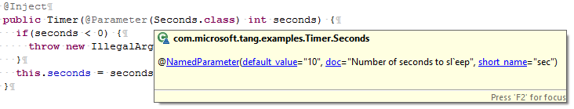

Tang is a configuration managment and checking framework that makes use of dependency injection to automatically instantiate distributed, multi-language applications.  It emphasizes explicit documentation and automatic checkability of configurations and applications over ad-hoc, application-specific configuration and bootstrapping logic.

Outline
-------

   * [Motivation](#motivation)
   * [Design principles](#design-principles)
   * [Tutorial: Getting started](#tutorial-getting-started)
     * [Defining configuration parameters](#configuration-parameters)
     * [Instantiating objects with Tang](#injection)
     * [Processing configuration options](#processing-configurations)
   * [Tutorial: Complex application architectures](#tutorial-complex-application-architectures)
     * [Distributed dependency injection](#distributed-dependency-injection)
     * [Dynamically setting parameters and choosing implementations](#bind)
     * [Creating sets of similar injectors](#child-injectors)
   * [Tutorial: Design patterns and best practices](#tutorial-design-patterns-and-best-practices)
     * [Modularity and complex configurations](#modularity-and-complex-configurations)
     * [Cyclic dependencies](#cyclic-dependencies)
   * [Roadmap](#roadmap)
     * [Using the injection plan API to choose between multiple implementations](#injection-plans)
     * [Language interoperability](#language-interoperability)

Motivation
============

Distributed systems suffer from problems that arise due to complex compositions of software modules and configuration errors.  These problems compound over time: best-practice object oriented design dictates that code be factored into independent reusable modules, and today's distributed applications are increasingly expected to run atop multiple runtime environments.  This leads application developers to push complexity into configuration settings, to the point where misconfiguration is now a primary cause of unavailability in fault tolerant systems.

Tang is our attempt to address these problems.  It consists of a dependency injection framework and a set of configuration and debugging tools that automatically and transparently bootstrap applications.  We have focused on providing a narrow set of primitives that support the full range of design patterns that arise in distributed system development, and that encourage application developers to build their systems in a maintainable and debuggable way.

Leveraging existing language type systems allows unmodified IDEs such as Eclipse or NetBeans to surface Tang configuration information in tooltips, provide auto-complete of configuration parameters, and to detect a wide range of configuration problems as you edit your code.  Since such functionality is surfaced in the tools you are already familiar with, there is no need to install (or learn) additional development software to get started with Tang.  Furthermore, we provide a set of sophisticated build time and runtime tools that detect a wide range of common architectural problems and configuration errors.

This documentation consists of a number of tutorials that present prefered Tang design patterns.  By structuring your application according to the patterns we suggest throughout the tutorials, you will allow our static analysis framework, Tint ("Tang Lint"), to detect problematic design patterns and high-level configuration problems as part of your build.  These patterns provide the cornerstone for a number of more advanced topics, such as interacting with legacy configuration systems, designing for cross-language applications, and multi-tenancy issues, such as secure injections of untrusted application code.  To the best of our knowledge, implementing such tools and addressing these real-world implementation constraints would be difficult, or even impossible, atop competing frameworks.

Design principles
=================

Tang encourages application developers to specify default implementations and constructor parameters in terms of code annotations and configuration modules.  This avoids the need for a number of subtle (and often confusing) dependency injection software patterns, though it does lead to a different approach to dependency injection than other frameworks encourage.

In the process of building complicated systems built atop Tang, we found that, as the length of configurations that are passed around at runtime increased, it rapidly became impossible to debug or maintain our higher-level applications.  In an attempt to address this problem, traditional dependency injection systems actually compound this issue.  They encourage the developers of each application-level component to implement a so-called "Module" that will introspect on the current runtime configuration, augment and modify it, and then return a new configuration that takes the new application component into account.

Application developers interact with such Modules by invoking ad-hoc builder methods, and manually passing configurations (in the correct order) from Module to Module.  In practice, Module implementations frequently delgate to each other, either via inheritance or via wrapper classes and chains of method invocations.  This makes it extremely difficult for developers and end-users to infer what the final value of a given configuration paramter will be at runtime, or even to figure out why a particular option was (or was not) set after an application runs.

In contrast, Tang uses a data-centric approach to avoid these issues:
- Configurations are "just data," and can be read and written in human readable formats.
- Interfaces and configuration paramters are encouraged to specify sane defaults, allowing production code to generate minimalistic configuration files, which makes it extremely easy for developers, end-users and system-administrators to see what's "strange" about a particular, problematic application instance.
- Configuration modules are "just data" as well.  Tang includes static analysis and documentation tools that, as part of the build, sanity check modules, and documents their side effects and any additional parameters they surface.

Furthermore, whenever possible, Tang is built upon, and surfaces _monotonic_ set oriented primitives.  This allows us to leverage recent theoretical results in commtative data types; particularly CRDTs, and the CALM theorem.  Concretely:
- Configuration options can be set at most once.  This avoids (or at least detects) situations in which application-level code inadvertantly "fights" over the setting of a particular option.
- Therefore, the results of most Tang configuration operations are independent of the order in which configurations are composed with each other at runtime.
- This allows Tang to detect configuration and injection problems much earlier than is possible with other approaches.
- Upon encountering a problem, Tang provides lightweight provenance information that assigns blame for the problem in a sound and complete fashion.

Finally, Tang is divided into a set of "core" primtives, and higher-level configuration "formats".  Tang's core focuses on dependency injection and static checking of configurations.  The formats provide higher-level primitives to end-users and developers that build atop libraries that leverage Tang.  The formats include:
- Command line parsing facilities.
- Round trip processing of properties-style configuration files (including type checking as the files are parsed).  This is used both as a cross-lanaguge interchange format at runtime, and for user-facing configuration files.
- Configuration Modules, which are discussed above, are statically specified data structures that allow applications to modularize configuration data, and that support a wide-range of runtime and build-time checks.

Each of these formats simply emits Tang Configurations, which are then composed (in an order-independent way) at runtime.

Improvements to these formats are planned, such as command-line tab completion, and improved APIs for extremely complex applications that are built by composing multiple Tang configurations to inject arbitrary object graphs.

Furthermore, Tang formats include documentation facilities, and automatic command line and configuration file parsing.  From an end-user perspective, this takes a lot of the guesswork out of configuration file formats.

Although Tang surfaces a text-based interface for end-users of the applications built atop it, all configuration options and their types are specified in terms of Java classes and annotations.  As with the core Tang primitives, this allows the Java compiler to statically check Tang formats for problems such as inconsistent usage of configuration parameters, naming conflicts and so on.  This eliminates broad classes of runtime errors.   These checks can be run independently of the application's runtime environment, and can find problems both in the Java-level implementation of the system, and with user-provided configuration files.  The tools that perform these checks are designed to run as a post-processing step of projects built atop Tang.  Like the Java compiler checks, this prevents such errors from making it to production environments.  It also prevents such errors from being exposed to application logic or end-users, greatly simplifying applications built atop Tang.

Taken together, these properties greatly simplify dependency injection in distributed environments.  Tang eliminates large classes of runtime configuration problems (which can be extremely difficult to debug in distributed environments), and provides facilities to make it easy for higher-level code to use information about the current runtime environment to choose the appropriate course of action.

We expect Tang to be used in environments that are dominated by "plugin"-style APIs with many alternative implementations.  Tang cleanly separates concerns over configuration management, dependency injection, and object implementations.  This hides most of the complexity of dependency injection from plugin implementers.  It also prevents plugin implementations from inadvertently breaking the high-level semantics that allow Tang to perform extensive static checking and to provide clean semantics in distributed, heterogeneous environments.

Tutorial: Getting started
=========================

This tutorial is geared toward people that would like to quickly get started with Tang, or that are modifying an existing Tang application.

Configuration Parameters
------------------------

Suppose you are implementing a new class, and would like to automatically pass configuration parameters to it at runtime:

```java
package com.example;

public class Timer {
  private final int seconds;

  public Timer(int seconds) {
    if(seconds < 0) {
      throw new IllegalArgumentException("Cannot sleep for negative time!");
    }
    this.seconds = seconds;
  }

  public void sleep() throws Exception {
    java.lang.Thread.sleep(seconds * 1000);
  }
}
```
Tang encourages applications to use Plain Old Java (POJO) objects, and emphasizes the use of immutable state for configuration parameters.  This reduces boiler plate (there is no need for extra setter methods), and does not interfere with encapsulation (the fields, and even the constructor can be private).  Furthermore, it is trivial for well-written classes to ensure that all objects are completely and properly instantiated; they simply need to check constructor parameters as any other POJO would.  Tang aims to provide end users with error messages as early as possible, and encourages developers to throw exceptions inside of constructors.  This allows it to automatically provide additional information to end-users when things go wrong:

```
Exception in thread "main" com.microsoft.tang.exceptions.InjectionException: Could not invoke constructor
	at com.microsoft.tang.implementation.java.InjectorImpl.injectFromPlan(InjectorImpl.java:584)
	at com.microsoft.tang.implementation.java.InjectorImpl.getInstance(InjectorImpl.java:448)
	at com.microsoft.tang.implementation.java.InjectorImpl.getInstance(InjectorImpl.java:465)
	at com.microsoft.tang.examples.Timer.main(Timer.java:44)
Caused by: java.lang.reflect.InvocationTargetException
	at sun.reflect.NativeConstructorAccessorImpl.newInstance0(Native Method)
	at sun.reflect.NativeConstructorAccessorImpl.newInstance(Unknown Source)
	at sun.reflect.DelegatingConstructorAccessorImpl.newInstance(Unknown Source)
	at java.lang.reflect.Constructor.newInstance(Unknown Source)
	at com.microsoft.tang.implementation.java.InjectorImpl.injectFromPlan(InjectorImpl.java:568)
	... 3 more
Caused by: java.lang.IllegalArgumentException: Cannot sleep for negative time!
	at com.microsoft.tang.examples.Timer.<init>(Timer.java:24)
	... 8 more
```

In order for Tang to instantiate an object, we need to annotate the constructor with an `@Inject` annotation.  While we're at it, we'll define a configuration parameter, allowing us to specify seconds on the command line, and in a config file.

```java
package com.example;

import javax.inject.Inject;

import com.microsoft.tang.annotations.Name;
import com.microsoft.tang.annotations.NamedParameter;
import com.microsoft.tang.annotations.Parameter;

public class Timer {
  @NamedParameter(default_value="10",
      doc="Number of seconds to sleep", short_name="sec")
  class Seconds implements Name<Integer> {}
  private final int seconds;

  @Inject
  public Timer(@Parameter(Seconds.class) int seconds) {
    if(seconds < 0) {
      throw new IllegalArgumentException("Cannot sleep for negative time!");
    }
    this.seconds = seconds;
  }

  public void sleep() throws Exception {
    java.lang.Thread.sleep(seconds * 1000);
  }
}
```
A few things happened here.  First, we create the new configuration parameter by declaring a dummy class that implements Tang's "Name" interface.  Name is a generic type, with a single mandatory parameter that specifies the type of object to be passed in.  Since Seconds implements ```Name<Integer>```, it is a parameter called "Seconds" that expects Integer values.

All instances of Name must be annotated with ```@NamedParamter```, which takes a number of options:
 * ```default_value``` (optional): The default value of the constructor parameter, encoded as a string.  Tang will parse this value (and ones in config files and on the command line), and pass it into the constructor.  For convenience Tang includes a number of helper variants of default value.  ```default_class``` takes a Class (instead of a String), while ```default_values``` and ```default_classes``` take sets of values.
 * `short_name` (optional): The name of the command line option associated with this parameter.  If omitted, no command line option will be created.  Short names must be registered by calling ```registerShortName()``` TODO: Which class is that in?
 * `doc` (optional): Human readable documentation, describing the purpose of the parameter.

Next, the ```@Inject``` annotation flags the constructor so that Tang will consider it when attempting to instantiate this class.  Finally, the ```@Parameter``` annotation tells Tang to use the configuration parameter when invoking the constructor.  Using a dummy class allows IDEs to autocomplete configuration parameter names, and lets the compiler confirm them as well:




Configuration modules
---------
Configuration modules allow applications to perform most configuration generation and verification tasks at build time.  This allows Tang to automatically generate rich configuration-related documentation, to detect problematic design patterns, and to report errors before the application even begins to run.

In the example below, we extend the Timer API to include a second implementation that simply outputs the amount of
time a real timer would have slept to stderr.  In a real unit testing example, it would likely interact with a scheduler based on logical time.  Of course, in isolation, having the ability to specify configuration parameters is not particularly useful; this example also adds a `main()` method that invokes Tang, and instantiates an object.

The process of instantiting an object with Tang is called _injection_.  As with configurations, Tang's injection process is designed to catch as many potential runtime errors as possible before application code begins to run.  This simplifies debugging and eliminates many types of runtime error handling code, since many configurations can be caught before running (or examining) application-specific initialization code. 


```
@DefaultImplementation(TimerImpl.class)
interface Timer {
  @NamedParameter(default_value="10",
      doc="Number of seconds to sleep", short_name="sec")
  class Seconds implements Name<Integer> {}
  public sleep() throws Exception;
}
class TimerImpl implements Timer {
  @Override
  public sleep() throws Exception {
    java.lang.Thread.sleep(seconds * 1000);
  }
}
class TimerMock implements Timer {
  public static class TimerMockConf extends ConfigurationModuleBuilder {
    public static final OptionalParameter<Integer> MOCK_SLEEP_TIME = new OptionalParameter<>();
  }
  public static final ConfigurationModule CONF = new TimerMockConf()
    .bindNamedParameter(Timer.Sleep, MOCK_SLEEP_TIME)
    .build();
  @Inject
  TimerMockConf(@Parameter(Timer.Sleep.class) seconds) {
    if(seconds < 0) {
      throw new IllegalArgumentException("...");
    }
    this.seconds = seconds; 
  }
  @Override
  public void sleep() {
    System.err.println("Would have slept for " + seconds + "sec.");
  }
}
static int main(String[] args) throws BindException, InjectionException {
  Configuration c = TimerMock.CONF
    .set(MOCK_SLEEP_TIME, 1)
    .build();
  Timer t = Tang.Factory.newInjector(c).getInstance(Timer.class);
  t.sleep();
}
```
Again, there are a few things going on here:
   - First, we push the implementation of `Timer` into a new class, `TimerImpl`.  The `@DefaultImplementation` tells Tang to use `TimerImpl` when no other implementation is expicitly provided.
   - We leave the Sleep class in the Timer interface.  This, plus the `@DefaultImplementation` annotation maintain backward compatibility with code that used Tang to inject the old `Timer` class.
   - The `TimerMock` class includes a dummy implementation of Timer, along with a `ConfigurationModule` final static field called CONF.
   - The main method uses `CONF` to generate a configuration.  Rather than set Timer.Sleep directly, it sets `MOCK_SLEEP_TIME`.  In a more complicated example this would allow `CONF` to route the sleep time to testing infrastructure, or other classes that are specific to the testing environment or implemenation of `TimerMock`.

ConfigurationModules serve a number of purposes:
   - They allow application and library developers to encapsulate the details surrounding their code's instantiation.
   - They provide Java APIs that expose `OptionalParameter`, `RequiredParameter`, `OptionalImplementation`, `RequiredImpementation` fields.  These fields tell users of the ConfigurationModule which subsystems of the application require which configuration parameters, and allow the author of the ConfigurationModule to use JavaDoc to document the parameters they export.
   - Finally, because ConfigurationModule data structures are populated at class load time (before the application begins to run), they can be inspected by static analysis tools that are exposed by Tang.

These tools are exposed by com.microsoft.tang.util.Tint, which is included by default in all Tang builds.  As long as Tang is on the classpath, invoking:
```
java com.microsoft.tang.util.Tint -doc tangdoc.html
```
will perform full static analysis of all classes the class path, and emit a nicely formatted HTML document that contains human readable documentation, and provides cross-references between configuration options, interfaces, classes, and the `ConfigurationModules` that use and set them. 

Here is the documentation for our Timer example:
```
TODO Screenshot of TangDoc
```
Here is a sample Tint build error.  Here, we added a typo to the string that specifies the default value of Timer.Sleep:
```
TODO Paste in a Tint build error
```

Raw configuration API
---------
Tang also provides a lower level configurtion API for applications that need more dynamic control over their configurations:

```java
...
import com.microsoft.tang.Tang;
import com.microsoft.tang.ConfigurationBuilder;
import com.microsoft.tang.Configuration;
import com.microsoft.tang.Injector;
import com.microsoft.tang.exceptions.BindException;
import com.microsoft.tang.exceptions.InjectionException;

...
  public static void main(String[] args) throws BindException, InjectionException {
    Tang tang = Tang.Factory.getTang();
    ConfigurationBuilder cb = (ConfigurationBuilder)tang.newConfigurationBuilder();
    cb.bindNamedParameter(Timer.Sleep.class, 5);
    Configuration conf = cb.build();
    Injector injector = tang.newInjector(conf);
    if(!injector.isInjectable(Timer.class)) {
      System.err.println("If isInjectable returns false, the next line will throw an exception");
    }
    Timer timer = injector.getInstance(Timer.class);

    try {
      System.out.println("Tick...");
      timer.sleep();
      System.out.println("Tock.");
    } catch(InterruptedException e) {
      e.printStackTrace();
    }
  }
```
The first step in using Tang is to get a handle to a Tang object by calling "Tang.Factory.getTang()".  Having obtained a handle, we run through each of the phases of a Tang injection:
   * We use `ConfigurationBuilder` objects to tell Tang about the class hierarchy that it will be using to inject objects and (in later examples) to register the contents of configuration files, override default configuration values, and to set default implementations of classes.  ```ConfigurationBuilder``` and ```ConfigurationModuleBuider``` export similar API's.  The difference is that ```ConfigurationBuilder``` produces ```Configuration``` objects directly, and is designed to be used at runtime.  ```ConfigurationModuleBuilder``` is desgined to produce data structures that will be generated and analyzed during the build, and at class load time.
   * bindNamedParameter overrides the default value of Timer.Sleep, setting it to 5.  Tang inteprets the 5 as a string, but allows instances of Number to be passed in as syntactic sugar.
   * We call `.build()` on the `ConfigurationBuilder`, creating an immutable `Configuration` object.  At this point, Tang ensures that all of the classes it has encountered so far are consistent with each other, and that they are suitable for injection.  When Tang encounters conflicting classes or configuration files, it throws a `BindException` to indicate that the problem is due to configuration issues. Note that `ConfigurationBuilder` and `Configuration` do not determine whether or not a particular injection will succeed; that is the business of the _Injector_.
   * To obtain an instance of Injector, we pass our Configuration object into `tang.newInjector()`.
   * `injector.isInjectable(Timer.class)` checks to see if Timer is injectable without actually performing an injection or running application code.  (Note that, in this example, the Java classloader may have run application code.  For more information, see the advanced tutorials on cross-language injections and securely building configurations for untrusted code.)
   * Finally, we call `injector.getInstance(Timer.class)`.  Internally, this method considers all possible injection plans for `Timer`.  If there is exactly one such plan, it performs the injection.  Otherwise, it throws an `InjectionException`.

Processing configuration data
-----------------------------

Tang provides a number of so-called _formats_ that interface with external configuration data.  ConfigurationModule is one such example (see the tutorial TODO).  This tutorial explains how to use Tang's default command line processing facilities, and properties configuration file parser.

[**TODO:** explain `processCommandLine()`]

[**TODO:** document configuration file API here]


Tang configuration information can be divided into two categories.  The first type, _parameters_, pass values such as strings and integers into constructors.  Users of Tang encode configuration parameters as strings, allowing them to be stored in configuration files, and passed in on the command line.

The second type of configuration option, _implementation bindings_, are used to tell Tang which implementation should be used when an instance of an interface is requested.  Like configuration parameters, implementation bindings are expressible as strings: Tang configuration files simply contain the raw (without the generic parameters) name of the Java Classes to be bound together.

New parameters are created and passed into constructors as in the examples above, by creating implementations of `Name<T>`, and adding `@NamedParameter`, `@Parameter` and `@Inject` annotations as necessary.  Specifying implementations for interfaces is a bit more involved, as a number of subtle use cases arise.

However, all configuration settings in Tang can be unambiguously represented as a `key=value` pair that can be interpreted either asan `interface=implementation` pair or a `configuration_parameter=value` pair.  This maps well to Java-style properties files.  For example:

```properties
com.examples.Interface=com.examples.Implementation
```

tells Tang to create a new Implementation each time it wants to invoke a constructor that asks for an instance of Interface.  In most circumstances, Implementation extends or implements Interface (`ExternalConstructors` are the exception -- see the next section).  In such cases, Tang makes sure that Implementation contains at least one constructor with an `@Inject` annotation, and performs the binding.

### Using external constructors to inject legacy code

TODO promote to top-level section.

Tang's _ExternalConstructor_ API supports injection of legacy code.  If Implementation does not subclass Interface, Tang checks to see if it subclasses ExternalConstructor<? extends Interface> instead.  If so, Tang checks that Implementation has an `@Inject` annotation on at least one constructor, and performs the binding as usual.  At injection time, Tang injects Implementation as though it implemented Interface, and then calls `newInstance()`, which returns the value to be injected.  Note that `ExternalConstructor` objects are single-use: `newInstance()` will only be called once.  If the `ExternalConstructor` class is marked as a singleton, Tang internally retains the return value of `newInstance()`, exactly as if the object had been created with a regular constructor.

Tutorial: Complex application architectures
===========================================

Composing configurations from multiple sources
----------------------------------------------

Distributed dependency injection
--------------------------------
In Tang, distributed injection is performed by writing Tang's current state out to configuration files, shipping them to remote machines, and using the configuration file to instantiate an identical Tang instance on the remote machine.  Two methods support such use cases.  The first is part of the Configuration API, and writes a well-formed configuration file to an output stream.  Its method signature is self-explanatory:

```java
public void writeConfigurationFile(OutputStream s)
```

Reading the file back is the responsibility of `ConfigurationBuilder`.  The following methods read the file line by line, merging the Configuration options they find with the current state of the `ConfigurationBuilder`.  If a conflicting or already-set option is encountered, processing halts on the line that caused the problem, and a `BindException` is thrown:

```java
public void addConfiguration(final File istream) throws IOException, BindException;
public void addConfiguration(final String istream) throws BindException;
```

Bind
----
Sometimes it is necessary to compute configuration information at runtime, and pass the result into Tang.  Tang provides two types of `bind()` methods for such purposes.  The first reside in `configurationBuilder()`, and are designed to preserve Tang's ability to write back the resulting configuration to a file.  Like configuration files, these methods can tell Tang which implementation should be used for a given interface, provide strings to be parsed into configuration parameters, and so on:

```java
void bind(String iface, String impl) throws ClassNotFoundException;
void bind(Class<T> iface, Class<?> impl);
void bindImplementation(Class<T> iface, Class<? extends T> impl);
void bindSingletonImplementation(Class<T> iface, Class<? extends T> impl);
void bindSingleton(Class<T> iface) throws BindException;
void bindNamedParameter(Class<? extends Name<T>> name, String value);
void bindConstructor(Class<T> c, Class<? extends ExternalConstructor<? extends T>> v);
```
Each of these methods throws BindException as well as the exceptions mentioned above, and behaves identically to the analogous configuration file primitives discussed above.  Note that, when possible, adding final [`StaticConfiguration`](static-configuration) objects to class definitions objects is always preferable to writing a method that invokes bind...() directly.

The second class of bind operations allow callers to pass object instances to Tang directly.  This prevents it from writing back its current state to a configuration file.  Because these methods are incompatible with writing configuration files, their names contain the word "Volatile", and they are part of the Injector API instead of ConfigurationBuilder.  Injectors cannot be serialized, and they are not allowed to modify the Configuration object that was used to create them, making it impossible to use the Tang API to write volatile objects to disk.

```java
Injector bindVolatileInstance(Class<T> iface, T inst) throws BindException;
Injector bindVolatileParameter(Class<? extends Name<T>> iface, T inst) throws BindException;
```
Note that these methods return new Injector objects.  Tang Injectors are immutable, and the original Injector is not modified by these calls.

A final method, `getNamedParameter()`, is sometimes useful when dealing with instances of objects used for Tang injections.  Unlike `getInstance()`, which performs a normal injection, `getNamedParameter()` instantiates an object in the same way as it would during an injection, as it prepares to pass a configuration parameter to a constructor (note that whether a new instance of the parameter is instantiated for each constructor invocation is not specified by the Tang API, so while the object returned likely `.equals()` the one that would be passed to a constructor, it may or may not `==` it.

Child injectors
---------------
Although extremely useful, features such as singletons and volatile parameters create a new problem.  Tang Configuration objects are designed to be built up from trees of related (but non-conflicting) configuration files, command line parameters, and so on.

One common use for singleton objects is to establish session or runtime _context objects_ that are used to track application state or implement network connection pools that should be available across multiple injections.  Without child injectors, such patterns would be impossible with Tang.  In order to avoid situations in which modules accidentally specify conflicting values for configuration parameters, Tang ensures that, once set, no implementation binding or parameter setting can be undone or overwritten.  The problem is that, in order to perform an Injection, the application must specify a complete configuration, hardcoding all future injections to return equivalent arguments.  This makes it impossible to pass request-level or activity-level parameters into future injected objects!

To get around the problem, Tang provides _child injectors_.  Child injectors are built by merging injectors with additional configuration objects.  Any singletons and volatile instances that have been set in the original (parent) injector will be shared with the child injectors.  As with `bindVolatile...()`, `createChildInjector()` does not mutate the parent object, but instead merges the configuration with a new copy.

Returning to our example, in order to share singletons between objects that are injected using different configurations, simply create an injector, and a set of configurations (one for each object to be instantiated).  Create singletons in the injector (preferred), or use `bindVolatile...()` to pass in an instance directly (use of `bindVolatile...()` is discouraged, but often necessary).  Then, use `createChildInjector()` to create one new injector for each configuration.

Since `createChildInjector()` does not modify the parent injector, the children can be created all at once in the beginning (which finds problems earlier), or the child injectors can be created one at a time, allowing them to reflect values computed by previously injected objects.

Roadmap
=======

Injection plans
---------------
[Coming soon]

Language interoperability
-------------------------
[Coming soon]

When things go wrong
--------------------
In the timer example, we specified a default value for the Sleep parameter.  If we hadn't done this, then the call
to `getInstance()` would have thrown an exception:
````
Exception in thread "main"
java.lang.IllegalArgumentException: Attempt to inject infeasible plan: com.example.Timer(Integer Seconds = null)
...
````
Since Tang refuses to inject null values into object constructors, the plan to invoke `Timer(null)` is considered infeasible.  Note that this error message enumerates all possible injection plans.  If Timer had more constructors or implementations those would be enumerated here as well.  Similarly, if more than one feasible plan existed, Tang would refuse to perform the injection, and throw a similar exception.

In both cases, the solution is to set additional configuration parameters to create a single feasible plan.  This can be done using any of the methods described above.

Looking under the hood
----------------------

### InjectionPlan

InjectionPlan objects explain what Tang would do to instantiate a new object, but don't actually instantiate anything.
Add the following lines to the Timer example;

````java
import com.microsoft.tang.implementation.InjectionPlan;
import com.microsoft.tang.implementation.InjectorImpl;
...
    InjectorImpl injector = (InjectorImpl)tang.newInjector(conf);
    InjectionPlan<Timer> ip = injector.getInjectionPlan(Timer.class);
    System.out.println(ip.toPrettyString());
    System.out.println("Number of plans:" + ip.getNumAlternatives());
````

Running the program now produces a bit of additional output:
````
new Timer(Integer Seconds = 10)
Number of plans:1
````

### TypeHierachy

InjectionPlan explains what would happen if you asked Tang to take some action, but it doesn't provide much insight into Tang's view of the object hierarchy, parameter defaults and so on.  TypeHierarchy object encode the state that Tang gets from .class files, including class inheritance relationships, parameter annotations, and so on.

Internally, in the example above, TypeHierarchy walks the class definition for Timer, looking for superclasses, interfaces, and classes referenced by its constructors.

## THIRD PARTY SOFTWARE
This software is built using Maven.  Maven allows you to obtain software libraries from other sources as part of the build process.  Those libraries are offered and distributed by third parties under their own license terms.  Microsoft is not developing, distributing or licensing those libraries to you, but instead, as a convenience, enables you to use this software to obtain those libraries directly from the creators or providers.  By using the software, you acknowledge and agree that you are obtaining the libraries directly from the third parties and under separate license terms, and that it is your responsibility to locate, understand and comply with any such license terms.  Microsoft grants you no license rights for third-party software or libraries that are obtained using this software.
